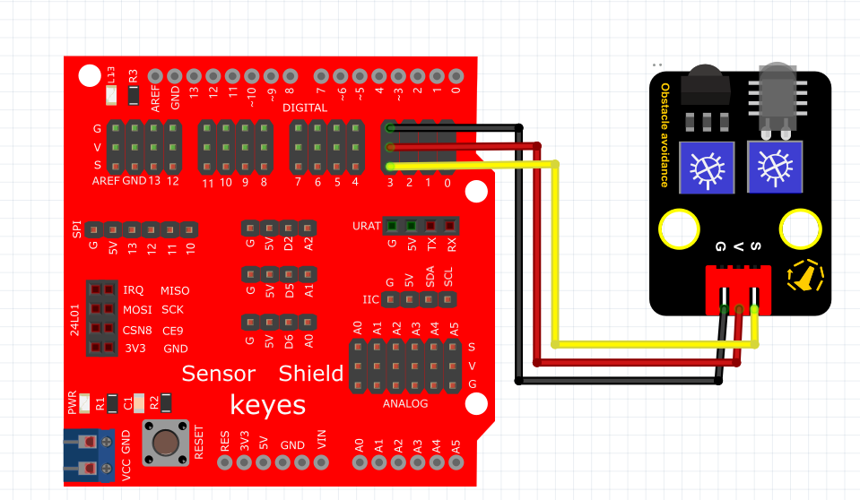

# Arduino


## 1. Arduino简介  

Arduino是一款开源电子原型平台，旨在通过易于使用的硬件和软件，帮助用户（包括初学者和专业人士）创造互动项目。Arduino由微控制器和开发环境构成，允许用户用C/C++语言编程，以控制各种传感器、马达和其他电子元件。它的出现简化了电子产品的开发，具有模块化、易学易用的特点，非常适合于教育、原型开发、艺术创作、机器人技术等多个领域。Arduino社区活跃，资源丰富，众多开源项目使得学习和创新变得轻松。  

## 2. 连接图  

  

## 3. 测试代码  

```cpp  
int sensorPin = 3; // 定义数字口3  
int ledPin = 13; // 定义数字口13  
int sensorState = 0; // 定义数字变量sensorState，并设为0  

void setup() {  
    pinMode(ledPin, OUTPUT); // 将ledPin设置为输出  
    pinMode(sensorPin, INPUT); // 将sensorPin设置为输入  
}  

void loop() {  
    sensorState = digitalRead(sensorPin); // 读取数字口3的数值，并赋值给sensorState  

    if (sensorState == LOW) { // 当sensorState为低电平时，LED亮起  
        digitalWrite(ledPin, HIGH); // LED亮起  
    } else {  
        digitalWrite(ledPin, LOW); // LED变暗  
    }  
}  
```  

## 4. 测试结果  

按照上图接好线，烧录好代码；通电后，靠近红外发射头的电位器顺时针调到尽头，再调节靠近红外接收头的电位器，观察D1灯，使D1灯关闭，并保持将要亮起的临界点，此时感应距离最长。当传感器没有检测到障碍物时，红外避障传感器上的D1灯关闭，板上的D13指示灯也关闭；当用障碍物挡住红外避障传感器时，红外避障传感器上的D1灯亮起，板上的D13指示灯随之亮起。


