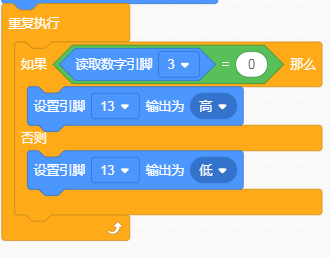

# KidsBlock

## 1. KidsBlock简介  

KidsBlock是一款图形化编程平台，旨在帮助初学者通过可视化的方式学习编程。它使用户能够通过拖放预定义的编程模块来创建程序，从而避免传统编码中常见的语法错误。KidsBlock特别适合年龄较小的学生或没有编程经验的用户，提供简单易用的界面和丰富的功能模块。该平台支持多种硬件，如Arduino，允许用户控制各种传感器和执行器，并制作互动项目，同时也可以通过图形化编程环境为用户提供直观的编程过程。  

## 2. 连接图  

  

## 3. 测试代码  

1. 在事件栏拖出Arduino启动模块。  

     

2. 在引脚栏拖出两个设置引脚模式模块，一个设置为引脚3输入，另一个设置为引脚13输出。  

     

3. 在控制栏拖出重复执行模块。  

     

4. 在控制栏拖出判断模块，然后在判断模块里添加运算的等于模块，等于模块的左边添加读取数字引脚3模块，右边为0；满足条件时放第13引脚输出高电平，不满足则第13脚输出低电平。  

     

## 4. 测试结果  

按照上图接好线，烧录好代码；上电后，通电后，靠近红外发射头的电位器顺时针调到尽头，再调节靠近红外接收头的电位器，观察D1灯，使D1灯关闭，并保持将要亮起的临界点，此时感应距离最长。当没有障碍物挡住红外避障传感器时，红外避障传感器上的D1灯关闭，板上的D13指示灯也关闭；当用障碍物挡住红外避障传感器时，红外避障传感器上的D1灯亮起，板上的D13指示灯亮起。

