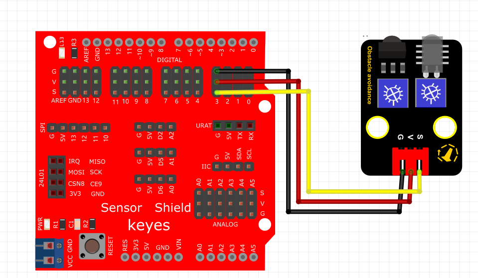
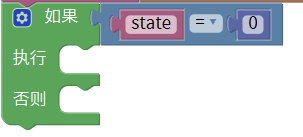
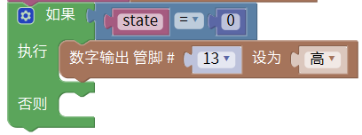
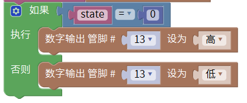

# Mixly

## 1. Mixly简介  

Mixly是一款图形化编程工具，旨在帮助初学者通过可视化的方式学习编程和电子项目。用户可以通过拖放不同的编程模块，以无需书写代码的方式，快速创建各种有趣的项目，避免了传统编程中的语法错误。Mixly特别适用于儿童和青少年教育，支持与多种硬件平台（如Arduino）兼容，能有效增强学习者的逻辑思维和创造能力。该平台允许用户运行和调试项目，配备了丰富的示例和清晰的用户界面，极大地简化了学习曲线，适合各种背景的学习者。  

## 2. 连接图  

  

## 3. 测试代码  

1. 在变量栏拖出声明变量模块，设置变量名为state并赋值为0。  

     

2. 在变量栏拖出state赋值模块，并在输入/输出栏拖出数字管脚模块设置管脚为3，然后赋值给state模块。  

     

3. 在控制栏拖出判断模块并在逻辑栏拖出等于模块，然后再变量栏拖出state变量模块放在等于模块的第一个格子里，在数学栏拖出数字模块放在等于模块的第二格并设置为0。  

     

4. 在输入/输出栏拖出数字输出模块并设置管脚为13，高电平。  

     

5. 在输入/输出栏拖出数字输出模块并设置管脚为13，低电平。  

     

## 4. 测试结果  

按照上图接好线，烧录好代码；通电后，靠近红外发射头的电位器顺时针调到尽头，再调整靠近红外接收头的电位器，观察D1灯，使D1灯关闭，并保持将要亮起的临界点，此时感应距离最长。当没有障碍物挡住红外避障传感器时，红外避障传感器上的D1灯关闭，板上的D13指示灯也关闭；当用障碍物挡住红外避障传感器时，红外避障传感器上的D1灯亮起，板上的D13指示灯随之亮起。

