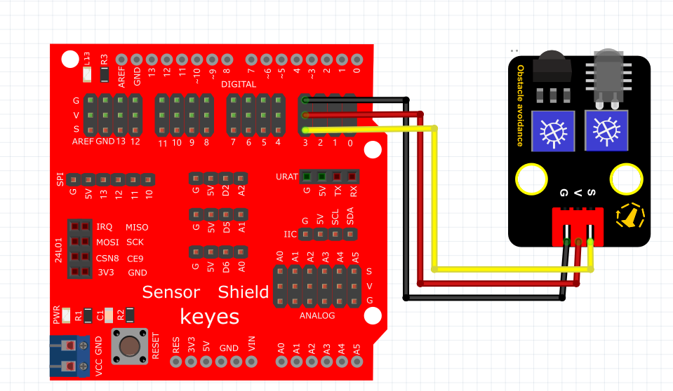

# Python


## 1. Python简介  

Python是一种高级编程语言，以其简洁明了的语法和强大的功能广受欢迎。自1991年发布以来，Python已经发展成为一个具有广泛应用范围的语言，涵盖数据科学、人工智能、Web开发、自动化脚本、科学计算等领域。Python支持多种编程范式，包括面向对象、过程式和函数式编程，拥有庞大的标准库和众多的第三方库（如NumPy、Pandas、Django等），这使得其在解决复杂问题时尤其高效。此外，Python具有跨平台特性，便于在不同操作系统之间进行开发和部署，适合各种背景的新手学习和专业开发者使用。  

## 2. 连接图  

  

## 3. 测试代码  

```python  
import machine  
import utime  

led = machine.Pin(25, machine.Pin.OUT)  # 设置25脚为led输出  
sensorPin = machine.Pin(28, machine.Pin.IN)  # 设置28脚为sensor输入  

while True:  
    if sensorPin.value() == 0:  # 判断sensor输入的值是否为0，如果是则执行LED灯亮的代码  
        led.value(1)  # LED灯亮  
    else:  
        led.value(0)  # LED灯灭  
```  

## 4. 测试结果  

按照上图接好线，烧录好代码；在通电后，靠近红外发射头的电位器顺时针调到尽头，再调节靠近红外接收头的电位器，观察D1灯，使其关闭，并保持将要亮起的临界点，此时感应距离最长。当没有障碍物挡住红外避障传感器时，红外避障传感器上的D1灯关闭，板上的指示灯也关闭；当用障碍物挡住红外避障传感器时，红外避障传感器上的D1灯亮起，板上的指示灯随之亮起。


